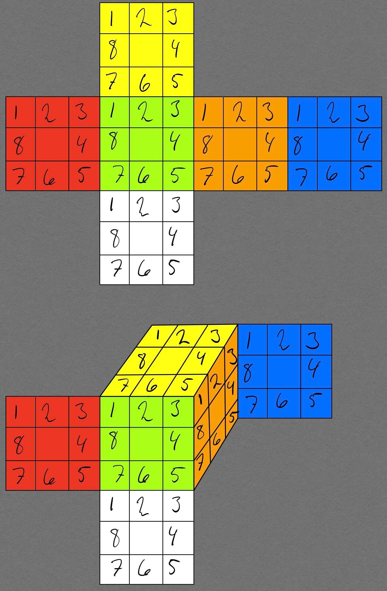
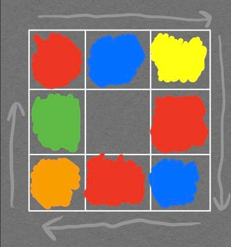

# Rubik’s Cube Solver

Rubik’s cube solver written in C++

## Solving Algorithms Implemented

- [x]  Thistlethwaite’s Algorithm
- [ ]  Korf’s algorithm

## Graph Searching Algorithms Implemented

- [x]  Breadth-First Search (BFS)
- [ ]  Depth-First Search (DFS)
- [ ]  Iterative Deepening Depth-First Search (IDDFS)

## Future Plans

- 3D model of Rubik’s cube in OpenGL
- Read state of Rubik’s cube through webcam (OpenCV)
- Serial communication with arduino for rotating cube with stepper motors

## Rubik’s Cube Notation

The program uses Singmaster notation for cube rotations:

U, D, F, B, R, L describes 90-degree clockwise rotations of the up, down, front, back, right and left face. Appending an apostrophe to a move. e.g. R’, reverses the rotation, resulting in an anti-clockwise rotation. Appending a 2 means a 180-degree rotation.

Example of a shuffle: R, U’, B, L2, D, F’, 

A Rubik’s cube consists of multiple cubies. There are 8 corner cubies, containing three stickers each, and 12 edge cubies, containing two stickers each. There are also 6 center cubies. These are static and cannot be moved relative to each other, meaning they represent the color of a face.

The program assumes the following center cubie colors:

| Face | Color |
| --- | --- |
| Up | Yellow |
| Down | White |
| Front | Green |
| Back | Blue |
| Right | Orange |
| Left | Red |

## Data Structure

In the cube solver a Rubik’s cube is represented as 6 bit-fields, one for each face. Each bit-field is a 32-bit unsigned integer consisting of 8 4-bit values. The four-bit values represent a color:

| Decimal value | Binary value | Color |
| --- | --- | --- |
| 0 | 0000 | Yellow |
| 1 | 0001 | White |
| 2 | 0010 | Green |
| 3 | 0011 | Blue |
| 4 | 0100 | Orange |
| 5 | 0101 | Red |

Rotations are done using a combination of bit-shifting and bit-masking.

The rationale for using bit-fields is keeping memory size down and compare times low. Solving a 3x3 Rubik’s cube requires a large graph structure and many comparisons.

## Bit-Fields Visualized

## Example Of Shuffled Cube Face

### Face description

| As string of characters | Hexadecimal | Binary | 32-bit int |
| --- | --- | --- | --- |
| RBYRBROG | 53053542 | 0101 0011 0000 0101 0011 0101 0100 0010 | 1392850242 |
